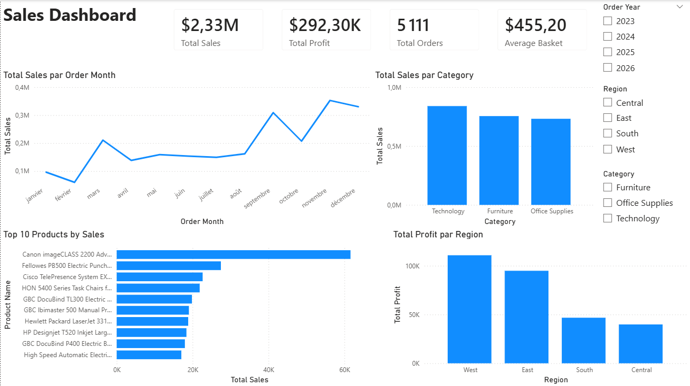

# Sales Dashboard – Analyse d’activité commerciale

## Présentation
Ce projet consiste à analyser un jeu de données de ventes à l’aide de Power BI afin de construire un dashboard interactif clair et exploitable. L’objectif est de suivre les principaux indicateurs commerciaux, d’identifier les catégories les plus performantes, de repérer les produits qui génèrent le plus de chiffre d’affaires et de comparer la rentabilité des différentes régions.

## Objectif
- Suivre les performances commerciales à travers des indicateurs clés
- Visualiser l’évolution des ventes dans le temps
- Identifier les catégories les plus performantes
- Mettre en évidence les produits les plus importants en chiffre d’affaires
- Comparer le profit entre les différentes régions

## Données utilisées
Le projet repose sur le dataset **Sample Superstore**, utilisé ici pour construire un dashboard de ventes.

Les colonnes principales exploitées sont :
- `Order Date`
- `Order ID`
- `Product Name`
- `Category`
- `Sales`
- `Profit`
- `Quantity`
- `Region`
- `Discount`

Les données ont été importées dans Power BI, vérifiées puis formatées afin d’assurer une lecture correcte des valeurs numériques, monétaires et temporelles.

## Outils utilisés
- Power BI
- Excel
- Dataset Sample Superstore

## Étapes du projet
1. Import des données
2. Vérification et correction des types de colonnes
3. Création des mesures principales
4. Construction du dashboard
5. Analyse des résultats
6. Préparation de la documentation du projet

## KPI suivis
Les indicateurs principaux utilisés dans le dashboard sont :
- **Total Sales**
- **Total Profit**
- **Total Orders**
- **Average Basket**

## Contenu du dashboard
Le dashboard principal permet de visualiser :
- l’évolution du chiffre d’affaires par mois
- le chiffre d’affaires par catégorie
- le top 10 des produits par chiffre d’affaires
- le profit par région

Des filtres permettent également d’explorer les données par :
- année
- région
- catégorie

## Principaux enseignements
- Les ventes ne sont pas réparties uniformément sur l’année. On observe un niveau plus faible en début d’année, suivi d’une progression plus marquée à partir de septembre, avec un pic visible en fin d’année.
- La catégorie **Technology** génère le chiffre d’affaires le plus élevé, devant **Furniture** et **Office Supplies**.
- Le chiffre d’affaires est concentré sur un nombre limité de produits, avec un premier produit nettement au-dessus des autres du top 10.
- La région **West** génère le profit le plus important, suivie de **East**, tandis que **South** et **Central** contribuent moins à la rentabilité globale.

## Limites du projet
- Cette première version se concentre sur une vue d’ensemble simple et lisible.
- L’analyse des retours n’a pas encore été intégrée.
- Le projet repose sur une seule page de dashboard afin de privilégier la clarté.

## Aperçu du dashboard



## Structure du projet
```text
dashboard-ventes/
├── data/
│   ├── raw/
│   └── cleaned/
├── dashboard/
│   └── dashboard_ventes.pbix
├── images/
│   └── dashboard_global.png
└── README.md
